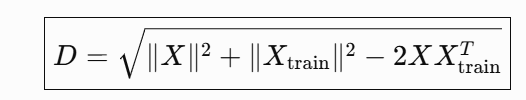
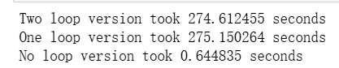
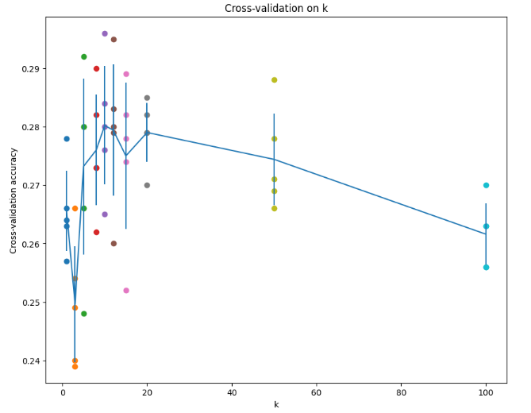

# KNN

kNN 分类器主要包含两个阶段：

训练阶段（Training）：分类器接收训练数据，然后简单地将这些数据记住。
测试阶段（Testing）：对于每一张测试图片，kNN 会将它与所有训练图片进行比较，然后找到与测试图片最相似的 k 个训练样本，并根据这 k 个样本的**标签(类别)** 来确定测试图片的预测类别。
k 的取值通过**交叉验证(cross-validation)**来确定。

在本练习中，你将：

实现 kNN 分类器的上述步骤；
理解基本的图像分类流程（Image Classification Pipeline）；
理解和使用交叉验证（Cross-Validation）；
掌握编写高效的向量化代码（Vectorized Code）。

**个人理解：**通过对比图片之间的差距实现对图片的分类，先找到最相近的k张图片，然后根据这k张图片的类别进行分类。

## 计算图片之间的距离（差距）

### 双循环距离计算

```python
def two_loops_distance_compute:
    num_test = X.shape[0]
    num_train = self.X_train.shape[0]
    dists = np.zeros((num_test, num_train))
    for i in range(num_test):
        for j in range(num_train):
            dists[i,j]=np.sqrt(np.sum(np.power(X[i]-X[j],2)))
return dists
        

```

核心计算公式如下：
$$
d_{i,j} = \sqrt{\sum_{k=1}^{n} \left( x_{i} - x_{j} \right)^2}
$$

### 单循环距离计算

```python
def ome_loops_distance_compute:
    num_test = X.shape[0]
    num_train = self.X_train.shape[0]
    dists = np.zeros((num_test, num_train))
    for i in range(num_test):
        dist[i]=np.sqrt(np.sum(np.power(self.X_train-X[i],2),axis=1))
    return dists
```

axis=1即 沿着列的方向求和，把每一行内的所有元素加起来。这里的作用是对每个训练样本独立计算各维度的平方差之和，从而得到该样本与查询点之间的欧氏距离。

### 零循环距离计算

```python
def no_loops_distance_compute:
    num_test = X.shape[0]
    num_train = self.X_train.shape[0]
    dists = np.zeros((num_test, num_train))
    dists=np.sqrt(np.power(X,2).sum(axis=1,keepdims=True)
                  +np.power(self.X_train,2).sum(axis=1,keepdims=True).T
                  -2*(X@self.X_train.T))
    return dists
```

利用了完全平方公式：



KNN 中用“完全不写循环”的方式，一次性计算所有测试样本和所有训练样本之间的欧氏距离。

np.power分别计算X和X_train的==各元素平方元素==，然后通过np.sum进行每一行求和，保留二维形状。再对训练集做转置（由于训练集的每张图位于每列的第一个，这样可以使求和的形状由（N，1）变为（1，N），而测试数据为（M，1）。此时两个矩阵都是二维，相加时刚好可以和为一个（M，N）的矩阵，对于每一行的测试图的方都加上训练图的方，最后再减去他们的内积再开方。）

---

### 总结：



从计算速度上来说，零循环>一循环>两循环，我们同时也可以看到一循环和两循环的差距并不大，只差1s。而零循环在速度可谓遥遥领先，这是因为**每次循环需要对整个训练集做大量 NumPy 运算和创建临时数组**。而**零循环**使用 NumPy 的向量化和矩阵运算一次性计算所有距离，把计算交给底层高速运算，故速度提升巨大。

---

## 标签预测

由上面的距离计算可以得到距离矩阵dists，我们可以通过dists来进行**标签预测**。

``` python
def predict_labels(self.dists,k=1):
    num_test=dists.shape[0]
    y_pred=np.zeros(num_test)
    for i in range(num_test):
        closest_y=[]
        closest_y=self.y_train[dists[i].argsort()[:k]]
        y_pred[i]=np.argmax(np.bincunt(closest_y))
return y_pred


```

这里通过argsort对dists[i]里的距离由小到大排序，[:k]选择了前k个数据的索引。在y_train中对应了距离最小的前k个标签。

`np.bincount()`  用来统计非负整数数组中每个整数值出现的次数，返回数组的索引对应原数组中的整数值。（这里无需担心==索引在投票会被打乱==，**bincunt中输入中的整数值是多少，就把它当作结果数组的索引。**）

`np.argmax()`找到**数组中最大值所在的位置（索引）**

这样即可实现对标签的投票。票数相同时，argmax返回返回第一个出现的最大值的索引。

即实现标签预测部分！

---

## 交叉验证

采用**k折交叉验证**。

```python
num_fold=5
k_choices=[1, 3, 5, 8, 10, 12, 15, 20, 50, 100]
y_train_folds=[]
x_train_folds=[]
X_train_folds = np.array_split(X_train, num_folds)
y_train_folds = np.array_split(y_train, num_folds)
k_toaccuracies={}#建立一个字典，用于记录不同k值下的准确率
for k in k_choices:
    k_to_accuracies[k] = []

    for i in range(num_folds):
     # 将 num_folds-1 份数据和标签作为训练样本
        X_train_temp = np.concatenate(np.compress(np.arange(num_folds) != i, X_train_folds, axis=0))
        y_train_temp = np.concatenate(np.compress(np.arange(num_folds) != i, y_train_folds, axis=0))
       # 根据训练数据训练分类器
        classifier.train(X_train_temp, y_train_temp)
      # 使用剩余的 fold（作为验证数据）进行预测
        y_pred_temp = classifier.predict(X_train_folds[i], k=k, num_loops=0)
     # 计算预测标签的准确率
        num_correct = np.sum(y_pred_temp == y_train_folds[i])
        k_to_accuracies[k].append(num_correct / len(y_pred_temp))

```


np.compress按照一个布尔条件，把数组中满足条件的元素筛选出来

​       `X_train_temp = np.concatenate(np.compress(np.arange(num_folds) != i, X_train_folds, axis=0))` 在这里就是选取5个中的一个作为测试样本，并把它从训练样本中摘出来。



---

## 内联问题：

##### 以下哪些预处理步骤不会改变使用 **L1 距离的最近邻分类器(Nearest Neighbor classifier)**的性能？请选择所有符合条件的选项。

a.减去整体均值 𝜇

b. 减去逐像素均值 $\mu_{ij}$(因为对于相同的像素位置 $m$，两个样本都减去了相同的 $\mu_m$)

c.减去整体均值 $\mu$，然后除以标准差 $\sigma$

d.减去逐像素均值 $\mu_{ij}$，然后除以逐像素标准差 $\sigma_{ij}$。(不同的差异可能会被放大放小)

e. 旋转数据的坐标轴。

###### 答案：

a,b,c

KNN 只有在预处理改变不同样本之间距离的相对大小时，才会改变分类结果。

| 预处理       | L1 距离大小规律    | 分类性能     |
| ------------ | ------------------ | ------------ |
| 减整体均值   | 不变               | 不变         |
| 减逐像素均值 | 不变               | 不变         |
| 整体标准化   | 所有距离乘相同常数 | 不变         |
| 逐像素标准化 | 不同维度缩放不同   | **可能改变** |
| 旋转坐标轴   | 距离关系可能改变   | **可能改变** |

##### 以下关于分类问题中的 k-最近邻（k-NN）的说法，哪些是正确的，并且对所有 k 都成立？请选择所有正确的选项。

a.k-NN 分类器的决策边界是线性的。

b. 1-NN 的训练误差始终小于或等于 5-NN 的训练误差。

c.1-NN 的测试误差始终小于 5-NN 的测试误差。

d.使用 k-NN 分类器对一个测试样本进行分类所需的时间，会随着训练集大小的增加而增加。

e.以上都不正确。

###### 答案：

b,d正确

**关于a:**
knn的原理是：对于一个新样本，找到离它最近的 K 个训练样本，少数服从多数。（这种都是非线性）
这意味着——每一个训练样本都可能在边界上"咬"出一个弧线，最终拼出复杂的形状。

 	K 越小：边界越崎岖，容易过拟合（对噪声敏感）

 	K 越大：边界越平滑，趋向于多数类的整体趋势

 	K → ∞：所有点都判为训练集中的多数类
**关于c:**

在测试阶段，`1-NN` 有可能将一张图像错误分类，而 `5-NN` 却可能得到正确的类别。即使距离最近的图像具有错误的标签，`5-NN` 中其他距离较近的图像仍然可能指向正确的类别，因此 `5-NN` 的错误率可能低于 `1-NN`。


