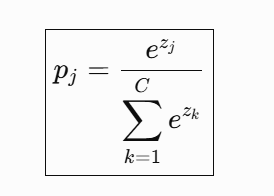
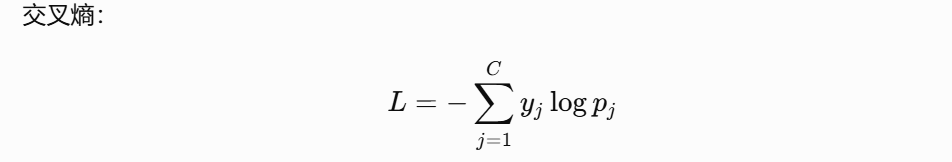
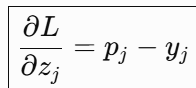
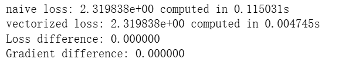
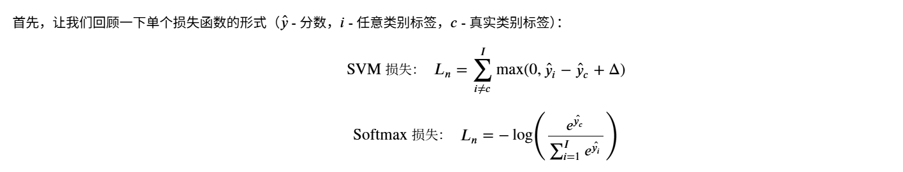
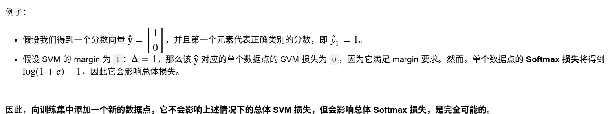

# softmax分类器

 	我们现在将开发一种更强大的图像分类方法，最终自然地推广到整个神经网络和卷积神经网络。该方法将包含两个主要组成部分：一个将原始数据映射到类别分数的**得分函数**，以及一个量化预测分数与真实标签之间的一致性的**损失函数**。然后我们将将其定义为一个优化问题，其中我们会使损失函数相对于得分函数参数最小化。这个练习与前面的 SVM 练习类似。你需要完成以下任务：

​         2.实现 Softmax 分类器的完全向量化损失函数（loss function）

 	3.实现 Softmax 分类器完全向量化的解析梯度（analytic gradient）

 	4.使用数值梯度（numerical gradient）检查所实现的梯度是否正确

 	5.使用验证集（validation set）调整和选择合适的：学习率（learning rate）、正则化 	强度（regularization strength）

 	6.使用 SGD（随机梯度下降，Stochastic Gradient Descent）对损失函数进行优化

 	可视化最终学习得到的权重（weights）

---

从最简单的线性映射函数
$$
f(x_i, W, b) =  W x_i + b
$$


---

## softmax损失函数

### 朴素版

```python
def softmax_loss_naive(W,X,y,reg):
    loss=0.0#loss初始化
    dW=np.zeros_like(W)
    N=X.shape[0]
    for i in range(N):
        y_hat=X[i]@W
        y_exp=np.exp(y_hat-y_hat.max())
        softmax=y_exp/y_exp.sum()
        loss-=np.log(softmax[y[i]])#y[i]是真实类别标号，即预测正类概率的索引
        softmax[y[i]]-=1
        dW+=np.outer(X[i],softmax)
    loss = loss / N + reg * np.sum(W**2)    # 平均损失并加入正则项
    dW = dW / N + 2 * reg * W
    return loss,dW
```

softmax在这的作用是将线性模型得出的分数转化为概率，具体实现代码在7，8行，对应公式：



此处采用了交叉熵损失函数，交叉熵损失函数的公式如下：



这里对应`loss-=np.log(softmax[y[i]])`，**y[i]只有在该类别是1，其他时期为0（one-hot）**。在此情景下，L对y_hat的求导为：



reg表示正则强度，这里采用正则项的原因是为了防止有些特征权重过大导致过拟合。` reg * np.sum(W**2)`使loss加大，即加大惩罚。`2 * reg * W`即正则的梯度。

### 向量化版

```python
def softmax_loss_vectorised(X,W,y,reg):
    loss=0.0
    dW=np.zeroe_like(W)
    N=X.shape[0]
    y_hat=X@W
    P=np.exp(y_hat-y_hat.max())
    P/=P.sum(axis=1,keepdims=True)
    loss=-np.log(P[range(N),y]).sum()/N+reg*np.sum(W**2)
    P[range(N),y]-=1
    dW+=X.T@P+2*reg*W
```

原理和朴素版相同，但采用了矩阵的方法，计算速度更快。



---

## 训练分类器

```python
from cs231n.classifiers import Softmax
results = {}
best_val = -1
best_softmax = None
# 这里提供这些参数作为参考。你可以根据需要选择是否修改这些超参数。
learning_rates = np.linspace(1e-7, 1e-6, 5)
regularization_strengths = np.linspace(1e3, 1e4, 5)
###### 使用for循环遍历所有学习率和正则强度

import itertools
for lr,reg in itertools.product(learning_rates,regularization_strengths):
    softmax=Softmax()
    softmax.train(X_train, y_train, lr, reg, num_iters=1000)
       # 计算训练集和验证集的准确率，并将结果添加到字典中
    y_train_pred, y_val_pred = softmax.predict(X_train), softmax.predict(X_val)
    results[(lr, reg)] = np.mean(y_train == y_train_pred), np.mean(y_val == y_val_pred)

   # 如果验证集准确率是最佳结果，则保存模型
    if results[(lr, reg)][1] > best_val:
        best_val = results[(lr, reg)][1]
        best_softmax = softmax

# *****END OF YOUR CODE (DO NOT DELETE/MODIFY THIS LINE)*****
```

其中Softmax()是在linear_classifiers.py中定义的类，通过__init__.py中的函数自加载。

---

## 内联问题

### 为什么我们期望我们的 loss 接近于 -log(0.1)？请简要解释。

###### 答案：

有 `10` 个类别，这意味着平均来说，通过随机猜测正确分类真实标签的概率为 `0.1`。由于我们的权重是随机初始化的，并且标准的 *softmax* 会将一个原始分数向量压缩成概率，因此得到正确预测的概率也应该是 `0.1`。我们期望得到 $-\log(0.1)$，因为实际的损失函数计算的是 *cross-entropy（交叉熵）*。

### 假设总体训练损失定义为所有训练样本的单个数据点损失之和。向训练集中添加一个新的数据点，有可能使 SVM 损失保持不变，但对于 Softmax 分类器的损失来说则不是这样。

###### 答案：

正确。



SVM损失本质是让模型为正确的标签分配一个足够高的分数。如果错误标签的分数已经比正确标签低了足够大的间隔（margin），那么损失中不会增加任何值。

softmax的本质是让模型提高正确标签的概率，使其尽可能接近 `1`，同时让其他类别的概率降低到 `0`。只要错误类别的分数是有限值，损失就仍然会受到影响，因为错误类别仍然会产生一定的概率，这使得真实类别的概率无法达到 `1`。




