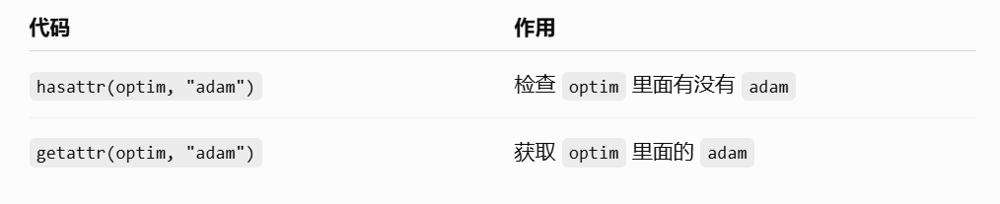
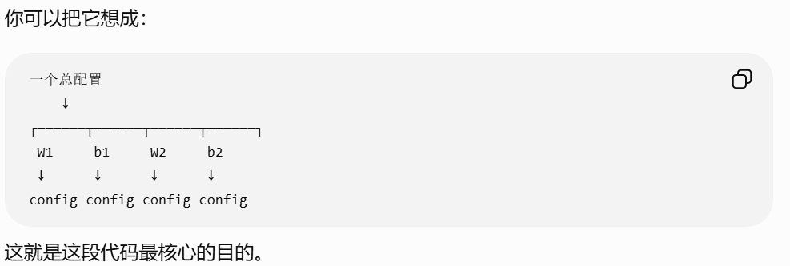
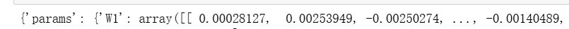
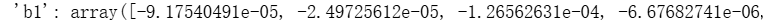
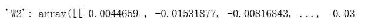
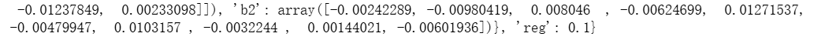
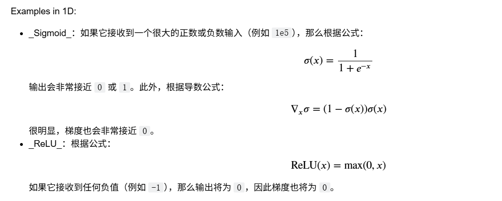

# 全连接神经网络

在本练习中，我们将采用模块化的方法实现全连接网络。对于每一层，我们都将实现一个 forward 函数和一个 backward 函数。forward 函数将接收输入、权重以及其他参数，并返回一个输出和一个用于存储反向传播所需数据的 cache 对象，如下所示：

```python
def layer_forward(x, w):
  """ 接收输入 x 和权重 w """
  # 进行一些计算 ...
  z = # ... 某个中间值
  # 做更多计算 ...
  out = # 输出
  cache = (x, w, z, out) # 一些我们需要计算梯度的值
  return out, cache
```

`反向函数`接收上游梯度和 `cache` 对象，并返回相对于输入和权重的梯度，例如：

```python
def layer_backward(dout, cache):
  """
    接收 dout（相对于输出的损失梯度）和 cache，
    并计算相对于输入的梯度。
  """
  # 解包 cache 中的值
  x, w, z, out = cache
  # 使用 cache 中的值计算梯度
  dx = # 相对于 x 的损失梯度
  dw = # 相对于 w 的损失梯度
  return dx, dw
```

---

## 前向传播

### 仿射层(affine_forward):

```python
def affine_forward(x, w, b):
    out=x.reshape(x.shape[0],-1)@w+b#将输入重塑为行向量进行计算
    cache=(x,w,b)
    return out,cache
```

Affine Layer 就是我们熟悉的**全连接层（Fully Connected Layer）**：


先把每个样本展平成一维向量，再做全连接计算 \(XW+b\)，最后把原始输入、权重和偏置保存起来，为 backward 计算梯度做准备。

### RELU前向传播(relu_forward):

```python
def relu_forward(x):
    out=np.maxium(0,x)
    cache=x
    return out,x
```

由于仿射层的变换是一个线性变换，连续的线性层仍然只是一个线性变换。需要加入非线性函数才可以让模型学习更复杂的函数。

RELU函数的表达式:


---

## 反向传播

### 仿射层(affine_backward):

```python
def affine_backward(dout,cache):
    x,w,b=cache
    dx,dw,db=None,None,None
    x_reshaped=x.reshaped(x.shape[0],-1)
    dx=(dout@w.T).reshape(x.shape[0],*x.shape[1:])
    dw=x_reshaped@w.t
    db=dout.sum(axis=0)
    return dx,dw,db  
```

**dx公式：**

**dW公式：**

**db公式：**

`dout @ w.T` 先计算展平后的 `dX`，得到 `(N,D)`；然后 `reshape(x.shape[0], *x.shape[1:])` 利用 `*` 将原始 `x` 的第 1 维及之后的形状解包出来，把 `dX` 恢复为与原始 `x` 相同的形状

### Relu层(relu_backward):

```python
def relu_backward(dout,cache):
    dx,x=None,cache
    dx=dout*(x>0)
    return dx     
```

由Relu的公式易推求导公式

---

## Sandwich层

神经网络中有一些常见的层组合模式经常被使用。例如，**Affine 层通常会紧跟一个 ReLU 非线性激活函数**。为了方便实现这些常见的组合模式，我们在 `cs231n/layer_utils.py` 文件中定义了几个便捷层（convenience layers）。

### 前向传播函数

```python
def affine_relu_forward(x,w,b):
    a, fc_cache = affine_forward(x, w, b)
    out, relu_cache = relu_forward(a)
    cache = (fc_cache, relu_cache)
    return out, cache
```

### 反向传播函数

```python
def affine_relu_backward(dout,cache)
    fc_cache, relu_cache = cache
    da = relu_backward(dout, relu_cache)
    dx, dw, db = affine_backward(da, fc_cache)
    return dx, dw, db
```

---

## 两层神经网络

一个带有 ReLU 非线性激活函数和 Softmax 损失的两层全连接神经网络，
采用模块化的层设计。我们假设输入维度为 D，隐藏层维度为 H，
并对 C 个类别进行分类。

网络结构应该是 affine - relu - affine - softmax。

注意，这个类不实现梯度下降；相反，它会与一个单独的 Solver 对象交互，
由 Solver 负责执行优化过程。

模型中可学习的参数存储在字典 self.params 中，
该字典将参数名称映射到对应的 NumPy 数组。

```python
class TwolayerNet(object):
    def__init__(
    self,input_dims=3*32*32*32,hidden_dims=100,num_classes=10,weight_scale=1e-3,reg=0.0,
    ):
        self.params={
            'W1':np.random.randn(input_dim,hideen_dim)*weight_scale,
            'b1':np.random.randn(hidden_dims)
            'W2':np.random.randn(hidden_dims,num_classes)*weight_scale,
            'b2':np.random.randn(num_classes)
        }
        self.reg=reg
    def loss(self,X,y=None):
        scores=None
        W1,b1,W2,b2=self.params.values()
        out1, cache1 = affine_forward(X, W1, b1)
        out2, cache2 = relu_forward(out1)
        scores, cache3 = affine_forward(out2, W2, b2)
        if y is None:
            return scores#如果没有y则在测试模式中，只需返回分数。
        loss,dloss=0.0,{}
        loss,dloss=softmax_loss(scores,y)
        loss+=0.5*self.reg*(np.sum(W1**2)+np.sum(W2**2))
        dout3,dw2,db2=affine_backward(dloss,cache1)
        dout2=relu_backward(dout3,cache2)
        dout1,dW1,db1=affine_relu_backward(dout2,cahce3)
        dW1+=0.5*reg*W1
        dW2+=0.5*reg*W2
        grads = {'W1': dW1, 'b1': db1, 'W2': dW2, 'b2': db2}
        return loss,grads
```

`loss()` 就是在做“**前向传播算出 scores → Softmax 算 loss → 反向传播算出各参数梯度 → 加上 L2 正则化 → 返回 loss 和 grads**”。其中 `cache` 保存前向传播的信息，专门供反向传播使用。

----

## solver.py

**大概由如下几部分构成：**

```python
def solver(object):
    def __init__():
        '''
        初始化
        '''
    def _reset(self):
        """
        为优化过程设置一些用于记录和管理的变量。不要手动调用此方法。
        """
    def _step(self):
        """
        执行一次梯度更新。该方法由 train() 调用，不应手动调用。
        """
    def _save_checkpoint(self):
        '''保存一次更新后的所有数据'''
    def check_accuracy(self, X, y, num_samples=None, batch_size=100):
        """检查准确率"""
    def train(self):
        """运行优化过程以训练模型。"""   
```

### 初始化

```python
def __init__(self,model,data,**kwargs):
        self.model = model
        self.X_train = data["X_train"]
        self.y_train = data["y_train"]
        self.X_val = data["X_val"]
        self.y_val = data["y_val"]
        # 解包关键字参数
        self.update_rule = kwargs.pop("update_rule", "sgd")
        self.optim_config = kwargs.pop("optim_config", {})
        self.lr_decay = kwargs.pop("lr_decay", 1.0)
        self.batch_size = kwargs.pop("batch_size", 100)
        self.num_epochs = kwargs.pop("num_epochs", 10)
        self.num_train_samples = kwargs.pop("num_train_samples", 1000)
        self.num_val_samples = kwargs.pop("num_val_samples", None)
        self.checkpoint_name = kwargs.pop("checkpoint_name", None)
        self.print_every = kwargs.pop("print_every", 10)
        self.verbose = kwargs.pop("verbose", True)
        if len(kwargs) > 0:
            extra = ", ".join('"%s"' % k for k in list(kwargs.keys()))
            raise ValueError("Unrecognized arguments %s" % extra)

        # 确保更新规则存在，然后将字符串名称替换为实际的函数
        if not hasattr(optim, self.update_rule):
            raise ValueError('Invalid update_rule "%s"' % self.update_rule)
        self.update_rule = getattr(optim, self.update_rule)

        self._reset()    
```

`pop`函数的作用是从字典 kwargs 中“取出并删除”指定的键。



### 为优化过程设置一些用于记录和管理的变量

```python
def reset(self):
        self.epoch = 0
        self.best_val_acc = 0
        self.best_params = {}
        self.loss_history = []
        self.train_acc_history = []
        # 为每个参数深拷贝一份 optim_config
        self.optim_configs = {}
        for p in self.model.params:
            d = {k: v for k, v in self.optim_config.items()}
            self.optim_configs[p] = d
```

reset() 就是给 Solver 做“训练前初始化”，把 epoch、loss、准确率、最佳模型参数以及优化器状态全部准备好。

`        for p in self.model.params:
            d = {k: v for k, v in self.optim_config.items()}
            self.optim_configs[p] = d`

遍历模型的每一个参数，并给每个参数复制一份独立的优化器配置，方便优化器保存该参数自己的状态。



### 梯度更新

```python
    def _step(self):
        """
        执行一次梯度更新。该方法由 train() 调用，不应手动调用。
        """
        # 抽取一个小批量的训练数据
        num_train = self.X_train.shape[0]
        batch_mask = np.random.choice(num_train, self.batch_size)
        X_batch = self.X_train[batch_mask]
        y_batch = self.y_train[batch_mask]
        # 计算 loss 和梯度
        loss, grads = self.model.loss(X_batch, y_batch)
        self.loss_history.append(loss)
        # 执行一次参数更新
        for p, w in self.model.params.items():
            dw = grads[p]
            config = self.optim_configs[p]
            next_w, next_config = self.update_rule(w, dw, config)
            self.model.params[p] = next_w
            self.optim_configs[p] = next_config
```

遍历模型的每个参数，根据当前参数的梯度和优化器状态，计算更新后的参数，然后保存回去。
这里的update_rule调用了在初始化代码中getattr中获得的optm.update_rule函数。，在此更新参数。
对于简单 SGD，可能变化不大；但对于 Adam、Momentum 等优化器，`config` 中的状态会不断更新。

### 模型保存

在训练过程中，把当前模型和训练状态保存到一个 .pkl 文件中，方便以后恢复训练或者查看训练结果。

```python
    def _save_checkpoint(self):
        if self.checkpoint_name is None:
            return
        checkpoint = {
            "model": self.model,
            "update_rule": self.update_rule,
            "lr_decay": self.lr_decay,
            "optim_config": self.optim_config,
            "batch_size": self.batch_size,
            "num_train_samples": self.num_train_samples,
            "num_val_samples": self.num_val_samples,
            "epoch": self.epoch,
            "loss_history": self.loss_history,
            "train_acc_history": self.train_acc_history,
            "val_acc_history": self.val_acc_history,
        }
        filename = "%s_epoch_%d.pkl" % (self.checkpoint_name, self.epoch)
        if self.verbose:
            print('Saving checkpoint to "%s"' % filename)
        with open(filename, "wb") as f:
            pickle.dump(checkpoint, f)
```

这里检查是否有`checkpoint_name`,如果没有就会直接结束。

这里保存的self.model[里保存的数据可以参考代码](# 两层神经网络)，基本就是W1,W2,b1,b2,reg;









==这个代码非用户手动调用，而是在train()里面直接调用。==

保存的pkl文件需在有模型类（也就是class two_layer_net下才可使用）

### 准确率检查

```python
    def check_accuracy(self, X, y, num_samples=None, batch_size=100):
        # 可能对数据进行子采样
        N = X.shape[0]
        if num_samples is not None and N > num_samples:
            mask = np.random.choice(N, num_samples)
            N = num_samples
            X = X[mask]
            y = y[mask]
        # 分批计算预测结果
        num_batches = N // batch_size
        if N % batch_size != 0:
            num_batches += 1
        y_pred = []
        for i in range(num_batches):
            start = i * batch_size
            end = (i + 1) * batch_size
            scores = self.model.loss(X[start:end])
            y_pred.append(np.argmax(scores, axis=1))
        y_pred = np.hstack(y_pred)
        acc = np.mean(y_pred == y)
        return acc
```

这里的mask指的不是掩码而是随机选择进行准确率检查的样本索引(从N中选出num_samples个数)。

```python
        for i in range(num_batches):
            start = i * batch_size
            end = (i + 1) * batch_size
            scores = self.model.loss(X[start:end])
            y_pred.append(np.argmax(scores, axis=1))
        y_pred = np.hstack(y_pred)
        acc = np.mean(y_pred == y)
        return acc
```

这一部分计算准确率，这里的loss函数只计算对每个类别给的分数。分数最高的就是他预测的类别。再通过mean函数计算算对的比例，作为准确率。

### 模型训练

```python
    def train(self):
        num_train = self.X_train.shape[0]
        iterations_per_epoch = max(num_train // self.batch_size, 1)
        num_iterations = self.num_epochs * iterations_per_epoch
        for t in range(num_iterations):
            self._step()
            # 也许打印一次训练 loss
            if self.verbose and t % self.print_every == 0:
                print(
                    "(Iteration %d / %d) loss: %f"
                    % (t + 1, num_iterations, self.loss_history[-1])
                )
            # 在每个 epoch 结束时，将 epoch 计数器加一，
            # 并对学习率进行衰减。
            epoch_end = (t + 1) % iterations_per_epoch == 0
            if epoch_end:
                self.epoch += 1
                for k in self.optim_configs:
                    self.optim_configs[k]["learning_rate"] *= self.lr_decay
            # 在第一次迭代、最后一次迭代以及每个 epoch 结束时，
            # 检查训练集和验证集的准确率。
            first_it = t == 0
            last_it = t == num_iterations - 1
            if first_it or last_it or epoch_end:
                train_acc = self.check_accuracy(
                    self.X_train, self.y_train, num_samples=self.num_train_samples
                )
                val_acc = self.check_accuracy(
                    self.X_val, self.y_val, num_samples=self.num_val_samples
                )
                self.train_acc_history.append(train_acc)
                self.val_acc_history.append(val_acc)
                self._save_checkpoint()

                if self.verbose:
                    print(
                        "(Epoch %d / %d) train acc: %f; val_acc: %f"
                        % (self.epoch, self.num_epochs, train_acc, val_acc)
                    )
                # 记录表现最佳的模型
                if val_acc > self.best_val_acc:
                    self.best_val_acc = val_acc
                    self.best_params = {}
                    for k, v in self.model.params.items():
                        self.best_params[k] = v.copy()
        # 训练结束时，将最佳参数交换到模型中
        self.model.params = self.best_params
```

每次迭代先调用 `_step()` 进行梯度更新，在一个 epoch 结束时再衰减学习率。学习率衰减的核心思想是，训练前期重视快速优化，训练后期重视精细调整。不过，衰减策略需要根据模型和训练任务选择，并不是所有情况下都必须采用固定的逐轮衰减。

在每次需要评估模型时，程序会计算模型在训练集和验证集上的准确率，并通过 `_save_checkpoint()` 将相关训练状态保存为 `.pkl` 检查点文件（前提是设置了 `checkpoint_name`）。

随后，程序比较当前验证集准确率与历史最佳验证集准确率。如果当前准确率更高，就将当前模型参数复制并保存到 `self.best_params` 中。训练结束后，再将 `self.best_params` 赋值给 `self.model.params`，使模型最终使用验证集表现最佳时的参数。

---

## 内联问题

### 我们只要求你实现 ReLU，但在神经网络中还有许多不同的激活函数可以使用，每种激活函数都有其优点和缺点。特别是，激活函数经常会出现的一个问题是，在反向传播过程中梯度流变为零（或接近零）。以下哪些激活函数会出现这个问题？如果考虑这些函数的一维情况，什么类型的输入会导致这种情况？

- *Sigmoid* 可能会发生饱和并使梯度消失——如果神经元的激活值接近 `1` 或 `0`，它的梯度就会变为 `0`，从而阻止参数进一步更新。如果数据没有进行归一化，或者权重的绝对值变得过大，就可能发生这种情况。
  - 补充说明：当较大的输入被传入网络层时，梯度可能会变得不平衡，并导致 _梯度爆炸（exploding gradient）_。
- *ReLU* 可能会“死亡”并停止允许参数更新——如果所有输入都使激活值变为 `0`，那么相对于输入的梯度也会变为 `0`。这可能是由于学习率过大造成的，因为过大的学习率可能使某个输入批次突然将权重推向很大的负值。
- 

### 现在你已经训练了一个神经网络分类器，你可能会发现测试集上的准确率远低于训练集上的准确率。我们可以通过哪些方式来减小这种差距？选择所有适用的选项。

1. **使用更大的数据集进行训练。**
2. **增加隐藏单元的数量。**
3. **增大正则化强度。**
4. **以上都不对。**

如果训练数据和测试数据之间的差距很大，说明模型出现了_过拟合（overfitting）_。只有 `1` 和 `3` 是可行的解决方案：

1. **正确（TRUE）** —— 数据越多，网络就越能够学习如何合理地衡量不同输入值的重要性。权重学习得越好，越能够让真正具有意义的特征影响网络的性能。因此，模型的泛化能力会更强，不容易对训练数据产生过拟合。不过，更大的数据集应该包含尽可能多样化的样本，因为相似的样本并不能提供新的信息。
2. **错误（FALSE）** —— 增加隐藏单元并不能解决_过拟合（overfitting）_问题，因为这会让模型能够学习训练数据中更多细微的模式以及可能存在的噪声或伪特征。
3. **正确（TRUE）** —— 通过增大正则化项来惩罚权重，可以提高模型的鲁棒性，因为这样可以避免某些权重对特定特征产生过大的影响。
